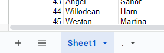
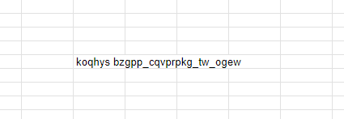

# Criminal Excel

> Ищем секреты в Excel

---

> Looking for secrets in Excel

## Решение / Solution

Документ таблиц `document.xls` состоит из двух листов:



Вторая страница состоит из одного значения:



Подбирая Viginère с ключом `grodno`, получаем `excele vismc_okebocwa_ci_ltqq`, а подставляя из этого
`excel` как ключ, получаем флаг.

Флаг:

```plain
grodno{excel_forensic_is_real}
```

---

The spreadsheet document `document.xls` consists of two sheets:


Second page consists of one value:


Combining Viginère with the key `grodno`, we get `excele vismc_okebocwa_ci_ltqq`, and substituting
this `excel` as the key, we get the flag.

```plain
grodno{excel_forensic_is_real}
```
