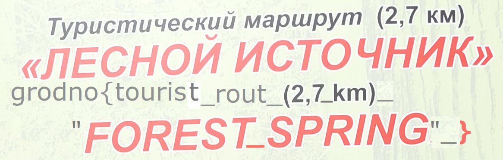

# Migraine

> Что-то с головою не в порядке ... Все забыл !
>
> А у меня завтра туристический маршрут ...

---

> Something is wrong with my head... I forgot everything!
>
> And tomorrow I have a tourist route...

## Решение / Solution

Файл `tourist_rout.jpg` начинается с данной последовательности (вывод через
`hexdump -C tourist_rout.jpg | head`):

```plain
00000000  ff d8 ff e0 10 4a 46 0a  00 00 00 0d 49 48 44 52  |.....JF.....IHDR|
00000010  00 00 0a 2c 00 00 12 10  08 06 00 00 00 7f d2 48  |...,...........H|
00000020  b4 00 00 00 04 67 41 4d  41 00 00 b1 8f 0b fc 61  |.....gAMA......a|
00000030  05 00 00 00 09 70 48 59  73 00 00 0e c4 00 00 0e  |.....pHYs.......|
00000040  c4 01 95 2b 0e 1b 00 00  00 0f 74 45 58 74 53 6f  |...+......tEXtSo|
00000050  75 72 63 65 00 53 4d 2d  41 37 32 35 46 31 3f 32  |urce.SM-A725F1?2|
00000060  a8 00 00 00 16 74 45 58  74 53 6f 66 74 77 61 72  |.....tEXtSoftwar|
00000070  65 00 41 37 32 35 46 58  58 55 31 41 55 42 34 19  |e.A725FXXU1AUB4.|
00000080  a2 f8 8c 00 00 00 07 74  49 4d 45 07 e5 07 12 0e  |.......tIME.....|
00000090  25 31 71 de 9e 42 00 00  00 20 74 45 58 74 43 72  |%1q..B... tEXtCr|
```

Все, что после первых 7 байт - содержание `.png` файла, а не `.jpg` как подразумевают первые 7 байт
и расширение в названии файла.

Скопируем первые 7 байт какого-либо `.png`-файла (`89 50 4e 47 0d 0a 1a  |‰PNG...|`) и откроем как
изображение. Нас встречает данное фото (обрезано):



Флаг:

```plain
grodno{tourist_rout_(2,7_km)_"FOREST_SPRING"_}
```

---

The `tourist_rout.jpg` file starts with the following sequence (output via
`hexdump -C tourist_rout.jpg | head`):

```plain
00000000  ff d8 ff e0 10 4a 46 0a  00 00 00 0d 49 48 44 52  |.....JF.....IHDR|
00000010  00 00 0a 2c 00 00 12 10  08 06 00 00 00 7f d2 48  |...,...........H|
00000020  b4 00 00 00 04 67 41 4d  41 00 00 b1 8f 0b fc 61  |.....gAMA......a|
00000030  05 00 00 00 09 70 48 59  73 00 00 0e c4 00 00 0e  |.....pHYs.......|
00000040  c4 01 95 2b 0e 1b 00 00  00 0f 74 45 58 74 53 6f  |...+......tEXtSo|
00000050  75 72 63 65 00 53 4d 2d  41 37 32 35 46 31 3f 32  |urce.SM-A725F1?2|
00000060  a8 00 00 00 16 74 45 58  74 53 6f 66 74 77 61 72  |.....tEXtSoftwar|
00000070  65 00 41 37 32 35 46 58  58 55 31 41 55 42 34 19  |e.A725FXXU1AUB4.|
00000080  a2 f8 8c 00 00 00 07 74  49 4d 45 07 e5 07 12 0e  |.......tIME.....|
00000090  25 31 71 de 9e 42 00 00  00 20 74 45 58 74 43 72  |%1q..B... tEXtCr|
```

Everything after the first 7 bytes - contents of a `.png` file, not of a `.jpg` file as implied by
the first 7 bytes and the filename's extension.

Let's copy the first 7 bytes of some random `.png` file (`89 50 4e 47 0d 0a 1a  |‰PNG...|`) and open
it as an image. It looks like this:


Flag:

```plain
grodno{tourist_rout_(2,7_km)_"FOREST_SPRING"_}
```
