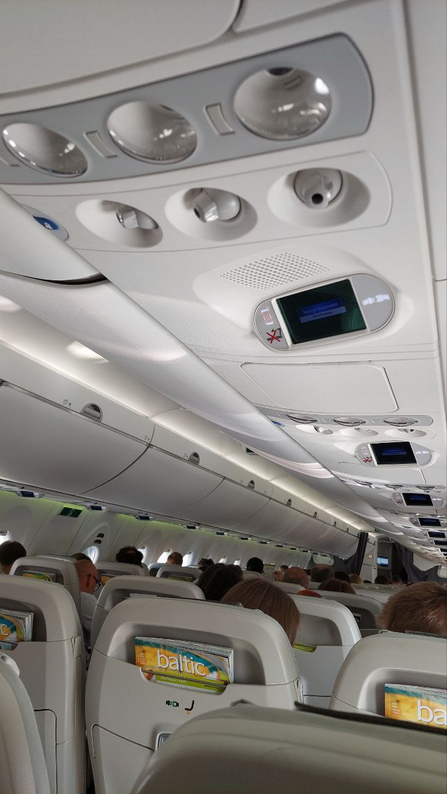
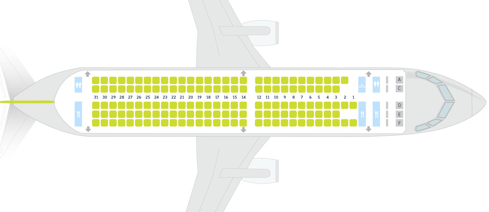

# Photo inside the airplane cabin

> В салоне самолета был сделан фотоснимок. Эксперту необходимо найти четыре характеристики - название авиаперевозчика, тип самолета, ряд и место, с которого > сделан снимок.
>
> Флаг в формате **grodno{airline;model_of_aircraft;row;place}**
>
> Например, **grodno{Belavia;Boeing_737-300;13;A}**

---

> A photograph was taken inside the plane. The expert needs to find four characteristics - the name of the air carrier, the type of aircraft, the row and the > place from which the photo was taken.
>
> Flag in the format **grodno{airline;model_of_aircraft;row;place}**
>
> For example, **grodno{Belavia;Boeing_737-300;13;A}**

---

## [Исходное фото / Source photo](aeroplane-2.jpg)



## Решение / Solution

1. Журнал `baltic`. Ищем авиакомпанию, находим `airBaltic`.

2. Ищем самолеты, которые имеют такие же сидения как на фото. Результирующий самолет -
`Airbus A220-300` (т.и.к. `Bombardier CS300`).

3. Находим [информацию о самолете от компании airBaltic](https://www.airbaltic.com/ru/vozdushniy-flot).
   Там же есть план сидений самолета:

   

4. Из фотографии видны три подряд идущих сидения. Это значит, что это место - `F`.

5. Ряд можно подобрать, примерно 15-25.

Флаг:

```plain
grodno{airBaltic;Airbus_A220-300;19;F}
```

---

1. The magazine says `baltic`. Searching for the airline, find `airBaltic`.

2. Searching for the planes that have the similar enough seats as in the photo. The resulting
plane - `Airbus A220-300` (aka `Bombardier CS300`).

3. [Information about the plane from the company airBaltic](https://www.airbaltic.com/ru/vozdushniy-flot).
   Also there is a plan of the seats:

   

4. In the photo, there are three seats in a row. This means that this place can only be `F`.

5. The row can be brute-forced, it is roughly 15-25.

Flag:

```plain
grodno{airBaltic;Airbus_A220-300;19;F}
```
