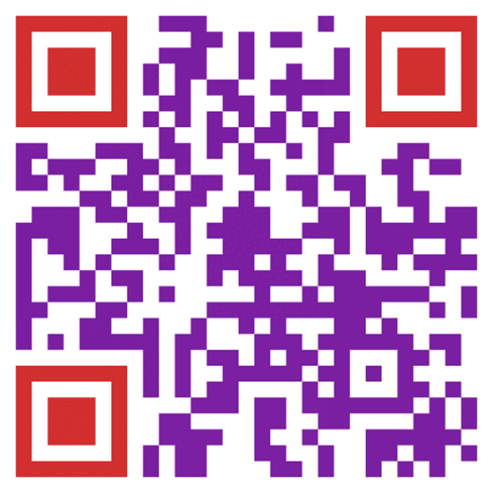

# Puzzles

> Чуть помедленней ...
>
> Очень быстро меняются картинки

---

> A little slower...
>
> Pictures change very quickly

## Решения / Solutions

Из данного `.gif`-файла нужно [вытянуть все фреймы](https://ezgif.com/split).

Далее нужно собрать все фреймы в целиковые [QR-коды](https://qrcoderaptor.com/), они содержат
кусочки флага.

  

Флаг:

```plain
grodno{In_t0day's_dig1tal_4ge,_QR_code5_h4ve_ev0lved_1nto_us3ful_tools for_pe0ple,_compan13s,_and_organ1zat10ns}
```

---

From the given `.gif` file you need to [extract all frames](https://ezgif.com/split).

Next you need to collect all frames into [QR-codes](https://qrcoderaptor.com/), they contain the
flag.

Flag:

```plain
grodno{In_t0day's_dig1tal_4ge,_QR_code5_h4ve_ev0lved_1nto_us3ful_tools for_pe0ple,_compan13s,_and_organ1zat10ns}
```
