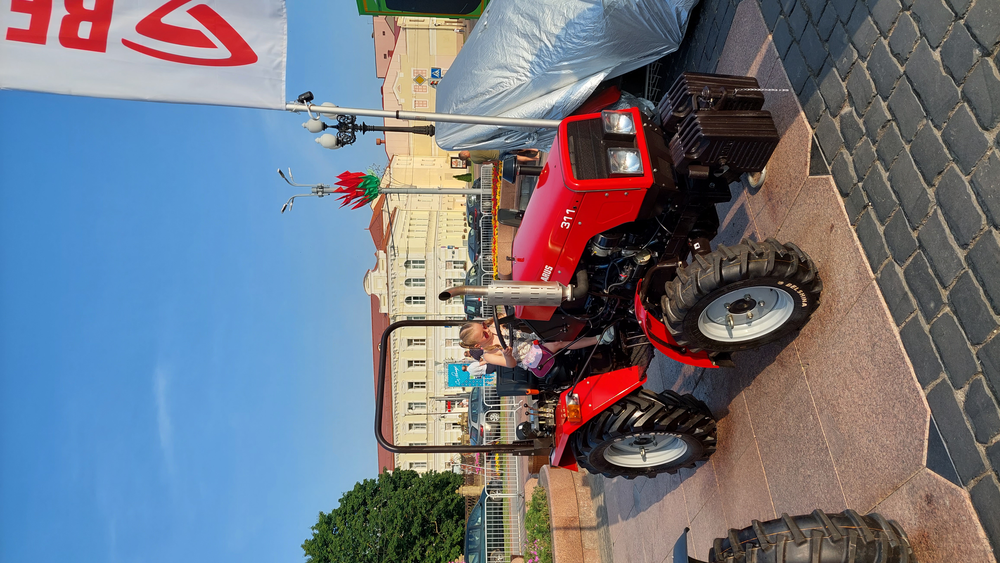

# A red tractor is coming to us

> Читаю новости:
>
> "Марка Aurus объявила о запуске серийного производства своей второй модели, внедорожника Aurus Komendant на заводе в Елабуге. Компания называет это «беспрецедентным стартом» ..."
>
> Потом еще раз смотрю на фото - черт, не "Aurus" - "ARUS" )))
>
> А у нас зато можно детский трактор дочке подарить. Хотя ...
>
> Подскажите, с какого минимального возраста в Беларуси можно начать учиться, получить права и какой категории на вождение такой красивой красной машины
>
> Флаг в формате
> **grodno{модель_трактора; категория_прав; мин_возраст_начала_учебы; мин_возраст_получения_прав}**.
> Латиницей. Без ненужных символов и пробелов

---

> I read the news:
>
> “The Aurus brand announced the launch of mass production of its second model, the Aurus Komendant SUV at the plant in Yelabuga. The company calls this an “unprecedented start” ...
>
> Then I look at the photo again - damn, not "Aurus" - "ARUS")))
>
> But here you can give a children’s tractor to your daughter. Although ...
>
> Tell me at what minimum age in Belarus you can start studying, get a license and what category is required to drive such a beautiful red car?
>
> Flag in the format **grodno{tractor_model;licence_category;min age of starting studies;min age of obtaining a license}**. Latin. No unnecessary characters or spaces

## [Исходное фото / Source photo](tracktor.jpg)



## Решение / Solution

1. Поиск на любом сервисе позволяет узнать, что это - Беларус МТЗ-311.

2. Поиск правил позволяет узнать, что права - категории B, минимальный возраст получения прав - 17,
   а обучаться можно за 2-3 года до этого.

Флаг:

```plain
grodno{Belarus_311;B;14;17}
```

---

1. Search on any service allows you to know what it is - Belarus MTZ-311.

2. Searching for rules allows you to know what rights - the category is B, the minimum age of
   obtaining rights is 17, and you can study for 2-3 years before that happens.

Flag:

```plain
grodno{Belarus_311;B;14;17}
```
