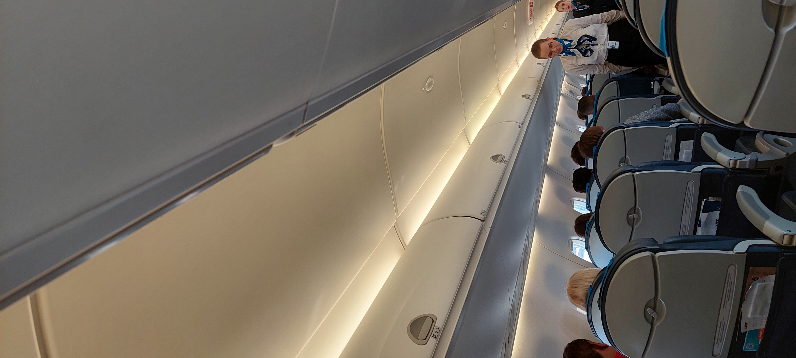

# Airplane

> В Гродно тоже есть аэропорт. Правда летел я из него последний раз лет 20 назад ...
>
> А на чьем самолете мы летим в этот раз ? Найдите три вещи - название авиаперевозчика, компании-произволителя самолетов и страну, в которой производятся эти самолеты.
>
> Флаг в формате grodno{airline;company;country}

---

> Grodno also has an airport. True, the last time I flew from it was about 20 years ago...
>
> Whose plane are we flying on this time? Find three things - the name of the airline, the aircraft manufacturer and the country in which the aircraft are manufactured.
>
> Flag in the format grodno{airline;company;country}

## [Исходное фото / Source photo](aeroplane.jpg)



## Решение / Solution

1. На фото видна авиакомпания LOT.

   

2. По [поиску Яндекс Картинок](https://ya.ru/images/) найдены все фото с данным самолетом (видно по
   сидениям) - это Embraer 190, производимый в Бразилии.

Флаг:

```plain
grodno{LOT;Embraer;Brazil}
```

---

1. On the photo the airline LOT is visible.

   

2. The search on [Yandex Images](https://ya.ru/images/) was used to find all photos of the aircraft
   (distinguishable by the seats) - this is Embraer 190, which is produced in Brazil.

Flag:

```plain
grodno{LOT;Embraer;Brazil}
```
