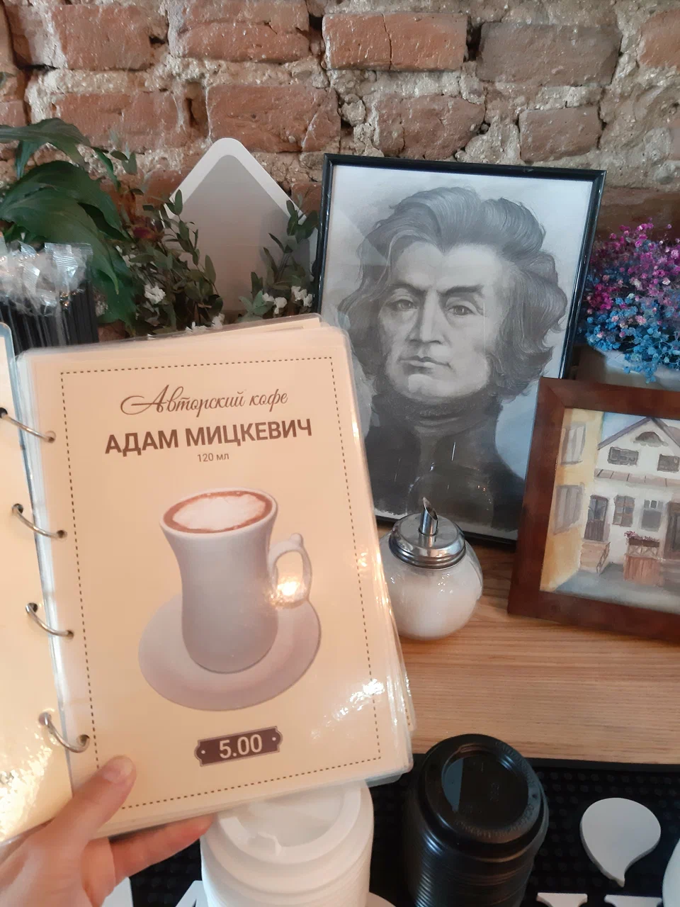

# Author's coffee

> Совсем забыл, где когда-то встретил вкусный кофе с именем поэта.
>
> Мне бы координаты, а там уж и сам найду ...
>
> Флаг в формате grodno{latitude;longitude}. Координаты в градусах, с точностью 3 знака после точки

---

> I completely forgot where I once met delicious coffee with the name of the poet.
>
> I would like the coordinates, and then I’ll find it myself...
>
> Flag in the format grodno{latitude;longitude}. Coordinates in degrees, with an accuracy of 3 digits after the point

## [Исходное фото / Source photo](coffee.jpg)


## Решение / Solution

1. На фото есть имя "Адам Мицкевич".

2. Раннюю жизнь он провел в Новогрудке.

3. Перебрав кофейни Новогрудка можно найти кофейню Кавярня.

   

4. Ее координаты на Гугл-картах `53.5988299, 25.8244226`.

> [!WARNING]
> Округления данные координаты не требует (нужна обрезка).
>
> Координаты с других карт могут не подойти.

Флаг:

```plain
grodno{53.598;25.824}
```

---

1. On the photo there is the name "Adam Mickiewicz".

2. The early life of Adam was in Novogrudok.

3. By checking coffee shops of Novogrudok you can find the coffee shop Kaviarnia.

   

4. Its coordinates on Google Maps `53.5988299, 25.8244226`.

> [!WARNING]
> The rounding of the coordinates is not required (truncate instead).
>
> Coordinates from other maps may not work.

Flag:

```plain
grodno{53.598;25.824}
```
