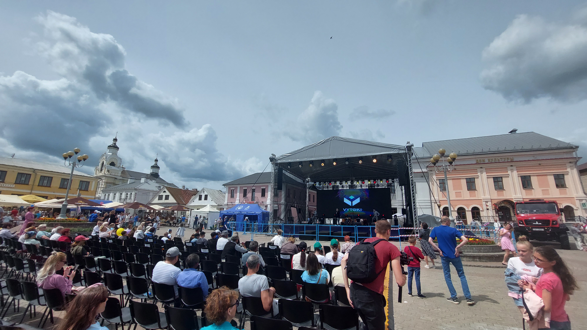
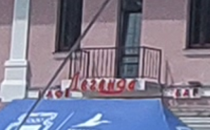
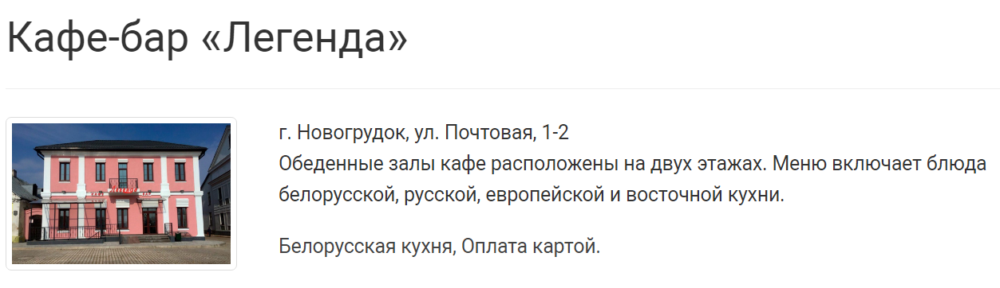

# Capital city

> Это фото сделано с городе с большой историей. Об этом, в частности, говорят несколько названий, которые можно разглядеть на фото.
>
> Узнайте его название и столицей какого государства он был. Оба название запишите латинскими букавами (можно ориентироваться на ресурс Wikipedia). Регистр не важен.
>
> Флаг в формате grodno{city_name;country_name}.

---

> This photo was taken in a city with a lot of history. This, in particular, is indicated by several names that can be seen in the photo.
>
> Find out its name and the capital of which state it was. Write both names in Latin letters (you can refer to the Wikipedia resource). Case is not important.
>
> Flag in the format grodno{city_name;country_name}.

## [Исходное фото / Source photo](capital_sity.jpg)



## Решение / Solution

1. Бар "Легенда" на фото:

   

2. По запросу "бар легенда беларусь" в Гугл-картинках найден идеальный адрес:

   

3. Новогрудок был столицей Великого княжества Литовского. На англоязычной википедии - "Novogrudok" и
   "Grand Duchy of Lithuania".

Флаг:

```plain
grodno{Novogrudok;Grand_Duchy_of_Lithuania}
```

---

1. Bar "Legend" on the photo:

   

2. Via query "bar legend belarus" in Google images an ideal address was found:

   

3. Novogrudok was the capital of the Grand Duchy of Lithuania.

Flag:

```plain
grodno{Novogrudok;Grand_Duchy_of_Lithuania}
```
