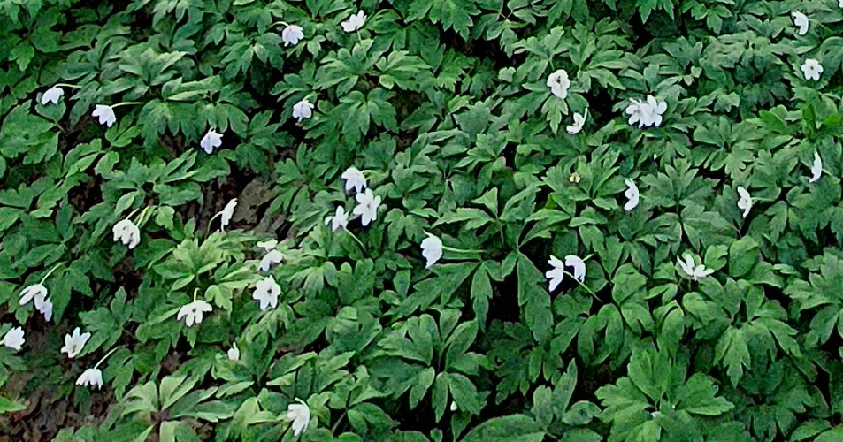
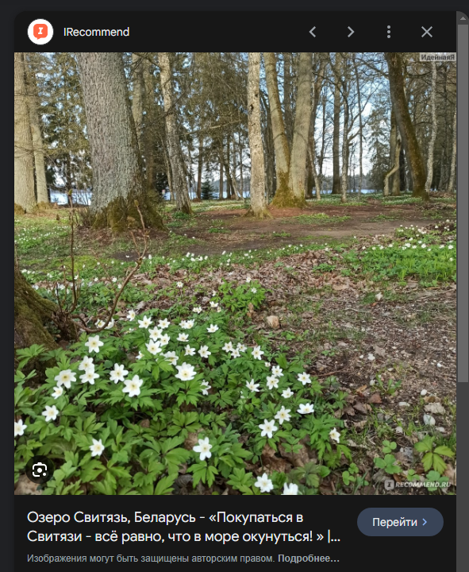

# Spring forest

> Это не парк Кёкенхоф. Это обычный белорусский лес. Правда не в новогоднюю пору )
>
> Помогите найти координаты центра озера, на берегу которого сделано это фото. Карты и немного стего ...
>
> Формат флага - grodno{latitude;longitude}. В градусах, с точностью до двух знаков после точки.

---

> This is not Keukenhof Park. This is an ordinary Belarusian forest. True, not during New Year's time)
>
> Help me find the coordinates of the center of the lake on the shore of which this photo was taken. Cards and a little stego...
>
> The flag format is grodno{latitude;longitude}. In degrees, accurate to two decimal places.

## [Исходное фото / Source photo](spring.jpg)


## Решение / Solution

1. Внизу фотографии видны белые цветы.

   

2. По запросу "белые цветы беларусь" было определено, что это - Первоцветы.

3. По запросу "первоцветы озера беларуси" в Гугл-картинках было определено, что это - "Свитязь".

   

4. Координаты в Википедии `53.4333°, 25.9167°`.

> [!WARNING]
> Координаты должны быть округлены.

Флаг:

```plain
grodno{53.43;25.92}
```

---

1. The bottom of the photo shows white flowers.

   

2. The query "белые цветы беларусь" ("white flowers Belarus") has shown that it is Primula.

3. The query "первоцветы озера беларуси" ("primula belarus lakes") in Google Images has shown it to
   be "Svityaz".

4. The coordinates in Wikipedia are 53.4333°, 25.9167°.

> [!WARNING]
> The coordinates should be rounded.

Flag:

```plain
grodno{53.43;25.92}
```
