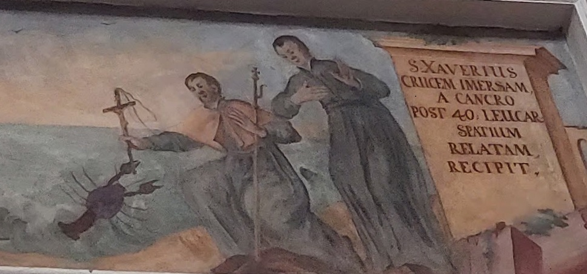

# Sursum Corda

> Это редчайший пример росписи в храме. Показывающей, что сила убеждения может покорять не только людей, но и весь мир вокруг. Наверно, нет больше в мире католического храма, где была бы такая фреска. Только в городе Гродно. В этом красивом здании.
>
> Как звали человека, имя которого связано с этим зданием, в каком городе какой страны и в какой церкви он похоронен. Для проверки написания слов использйте ресурс Wikipedia
>
> Флаг в формате grodno{name_surname;country;city;place}.
> например, grodno{Raffaello_Santi;Italia;Rome;Pantheon}

---

> This is a rare example of painting in a temple. Showing that the power of persuasion can conquer not only people, but the whole world around. There is probably no other Catholic church in the world that has such a fresco. Only in the city of Grodno. In this beautiful building.
>
> What was the name of the person whose name is associated with this building, in what city of what country and in what church is he buried. To check the spelling of words, use the resource Wikipedia
>
> Flag in the format grodno{name_surname;country;city;place}.
> for example, grodno{Raffaello_Santi;Italia;Rome;Pantheon}

## [Исходное фото / Source photo](monks_and_crab.jpg)



## Решение / Solution

1. Верхний текст говорит "S. Xaverius".

2. Это Франциск Ксаверий.

3. Он похоронен в Базилике Бон-Жезус, Старый Гоа, Индия.

Флаг:

```plain
grodno{Francis_Xavier;India;Old_Goa;Basilica_of_Bom_Jesus}
```

---

1. The top text says "S. Xavierius".

2. This is Francis Xavier.

3. He was buried in Basilica of Bom Jesus, Old Goa, India.

Flag:

```plain
grodno{Francis_Xavier;India;Old_Goa;Basilica_of_Bom_Jesus}
```
