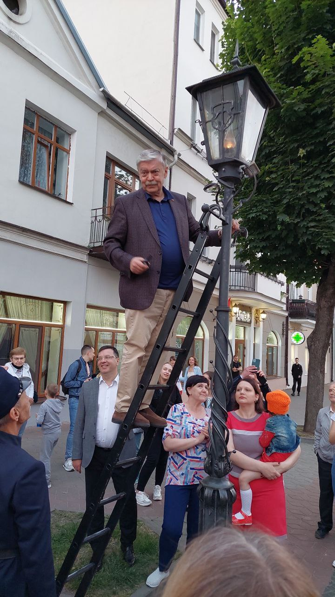
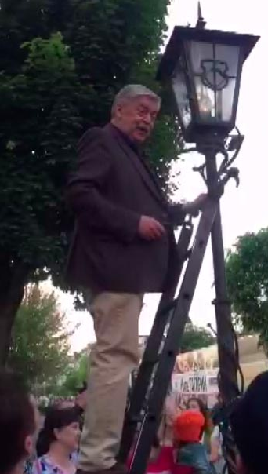

# Time to turn on the lights

> На снимке - солидный человек, который поднимается по лестнице на фонарный столб. На столбе старинный керосиновый фонарь. Явно это связано с какой-то красивой традицией.
>
> Подскажите имя и фамилию этого человека, название города, где это происходит и дату, когда это произошло, Используйте английское написание, принятое на ресурсе Wikipedia.
>
> Формат флага grodno{Firstname_Lastname;City;DD.MM.YYYY}.
>
> Например, grodno{Donald_Knuth;Milwaukee;10.01.1932}

---

> The picture shows a respectable man climbing a ladder onto a lamppost. There is an old kerosene lantern on the pole. Obviously this is connected with some beautiful tradition.
>
> Tell me the first and last name of this person, the name of the city where this happens and the date when it happened. Use the English spelling accepted on the Wikipedia resource.
>
> Flag format grodno{Firstname_Lastname;City;DD.MM.YYYY}.
>
> For example, grodno{Donald_Knuth;Milwaukee;10.01.1932}

## [Исходное фото / Source photo](street_lamp.jpg)



## Решение / Solution

1. Поиск данной традиции показывает, что это - Брест.

2. Поиск в Яндекс картинках позволяет найти этого мужчину в статье от 6 июня 2021 года.

   

3. Это посол России в Беларуси - Евгений Владимирович Лукьянов, работавший в 2021-2022 гг. Его имя
   на [английской странице всех послов России в Беларуси в Википедии](https://en.wikipedia.org/wiki/List_of_ambassadors_of_Russia_to_Belarus) -
   "Yevgeny Lukyanov"

Флаг:

```plain
grodno{Yevgeny_Lukyanov;Brest;06.06.2021}
```

---

1. Searching for this tradition shows that it is Brest.

2. Searching in Yandex pictures allows you to find this man in an article dated June 6, 2021.

   

3. It is the ambassador of Russia to Belarus - Yevgeny Lukyanov, who was in appointed in 2021-2022.

```plain
grodno{Yevgeny_Lukyanov;Brest;06.06.2021}
```
