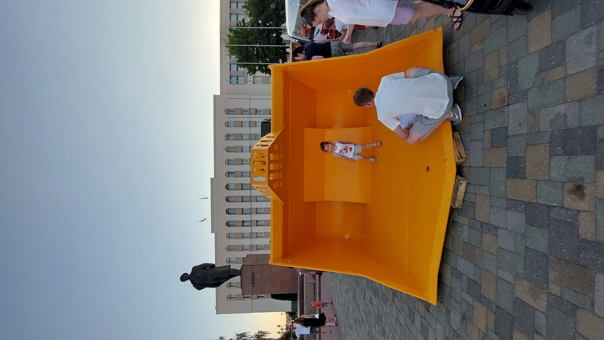

# To the delight of children

> Кто в детстве не мечтал иметь машинку с лопаткой. Может чуть поменьше ...
>
> Флаг - название модели этого инженерного шедевра и город, где ее производят. В формате grodno{model;city}.

---

> Who in childhood did not dream of having a car with a shovel? Maybe a little less...
>
> The flag is the name of the model of this engineering masterpiece and the city where it is produced. In the format grodno{model;city}.

## [Исходное фото / Source photo](sandbox_shovel.jpg)



## Решение / Solution

1. Поиск позволяет выяснить, что это выставка от БелАЗа (а также МоАЗа) перед Площадью Ленина в
   Гродно на IX форуме регионов Беларуси и России.

2. После [упорного поиска](https://news.drom.ru/68781.html) можно добиться, что это - МоАЗ-4055
   (жуткий подгон формы флага).

Флаг:

```plain
grodno{MoAZ-4035;Mogilev}
```

---

1. Search allows to find out what this exhibition is from BelAZ (and also MoAZ) in front of the
   Lenin Square in Grodno on the IX forum of regions of Belarus and Russia.

2. After [a stubborn search](https://news.drom.ru/68781.html) you can figure out that this is
   MoAZ-4055 (requires nasty fitting to the form of the flag that they want).

Flag:

```plain
grodno{MoAZ-4035;Mogilev}
```
