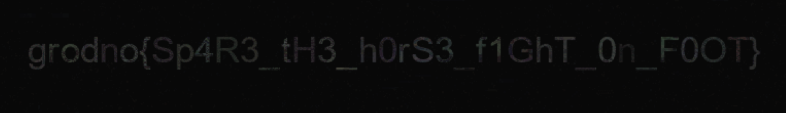

# Radahn

> I was born a champion's cub. Now I am the Lord of the Battlefield's lion.

## Решение / Solution

Даны файлы `radahn.png` и `negative.png`. Инвертируем `negative.png`, вычтем его из `radahn.png`, и
увеличим яркость.



Флаг:

```plain
grodno{Sp4R3_tH3_h0rS3_f1GhT_0n_F0OT}
```

---

Files `radahn.png` and `negative.png` are given. Let's invert `negative.png` and subtract it from
`radahn.png` and follow it up by a brightness increase.


Flag:

```plain
grodno{Sp4R3_tH3_h0rS3_f1GhT_0n_F0OT}
```
