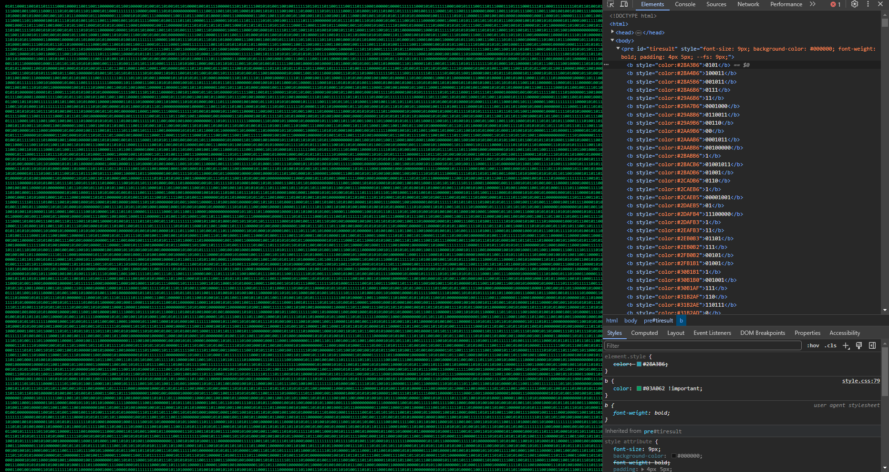
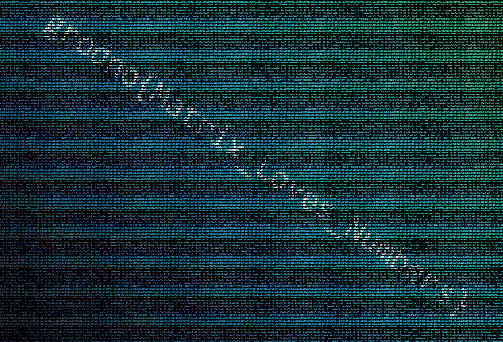

# Matrix

> Нажимаем *(ссылка на страницу)*

Представляет собой страничку из огромного количества нулей и единиц. Каждые несколько имеют цвет
примененный непосредственно к элементам `<b>`.



Также можно заметить стиль, примененный ко всем элементам `<b>`, который принудительно заменяет
цвета. Если его отключить появляется изображение.



Флаг:

```plain
grodno{Matrix_Loves_Numbers}
```

---

> Click *(links to the webpage)*

Represents a page with a huge amount of zeros and ones. They come in chunks that have an inline
styles for coloring `<b>` elements.


Additionally, you can notice a style that is applied to the `<b>` element. When you disable it you
will see an image appear.


Flag:

```plain
grodno{Matrix_Loves_Numbers}
```
